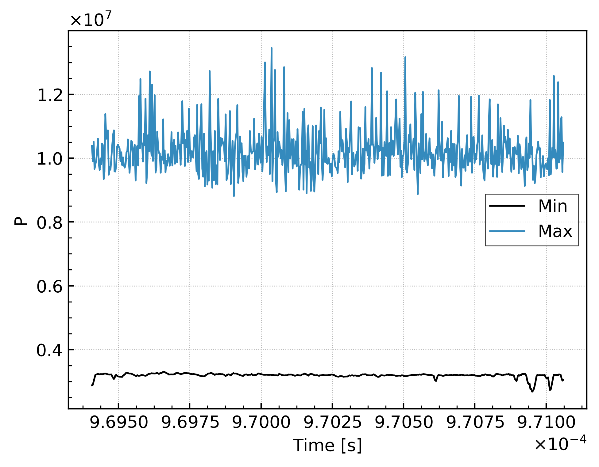
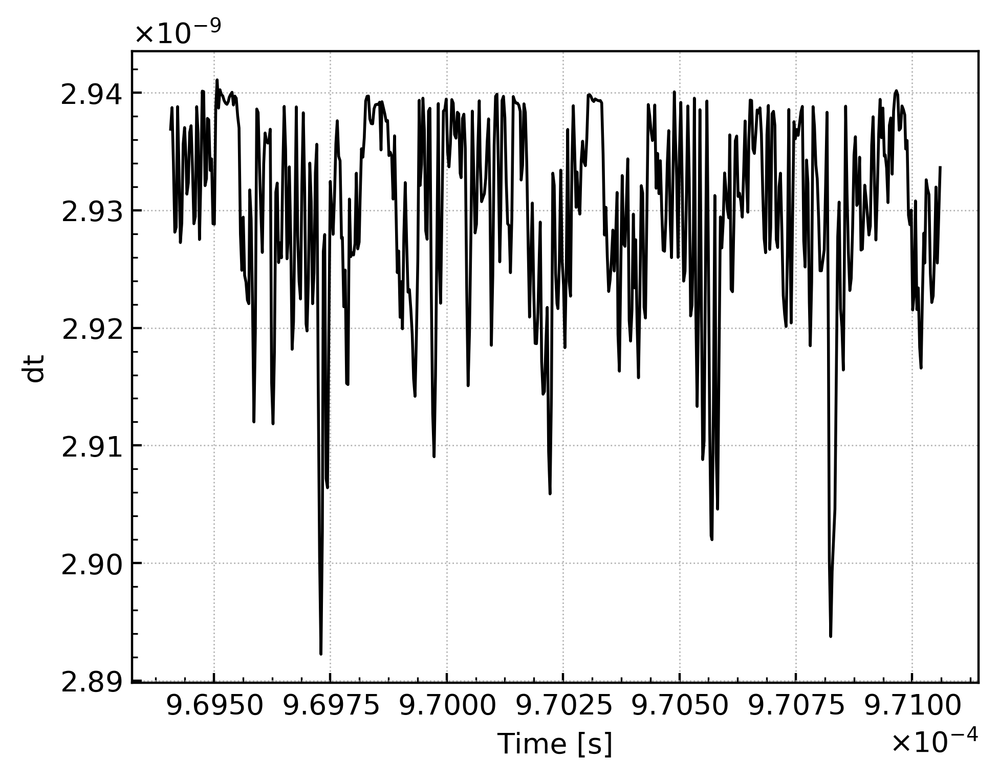
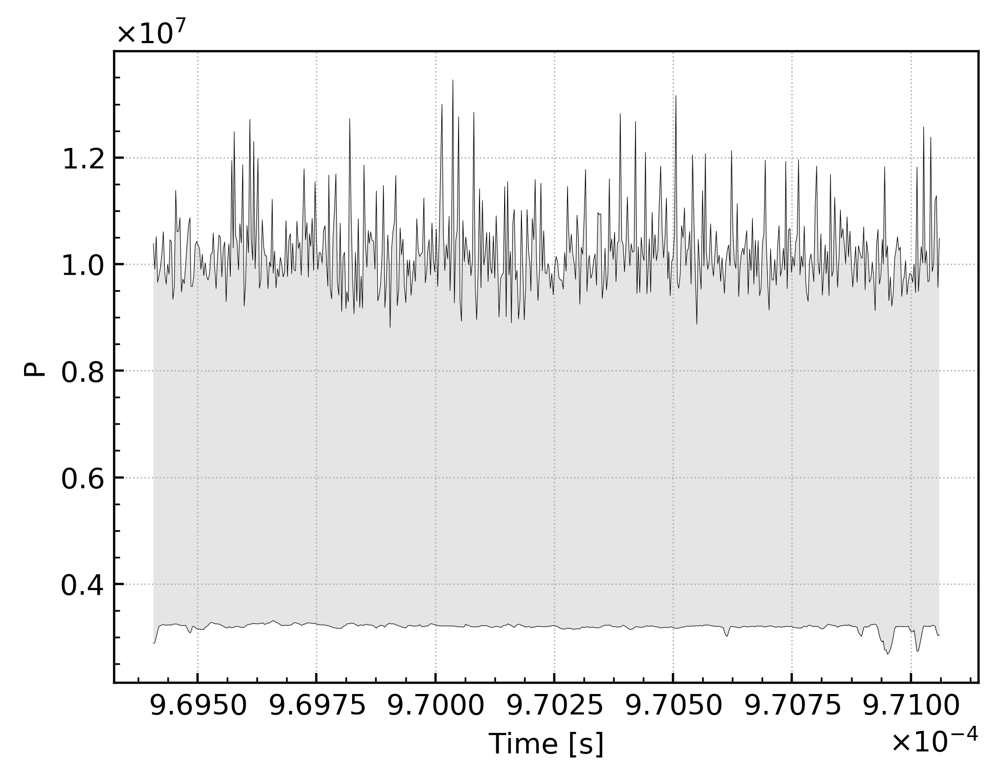

# CharlesX log min max

This project is a simple tool to extract and plot data outputed in the log of [CharlesX](https://github.com/IhmeGroup/CharlesX).

## Install

To install the tool you need to install the python package in your current python environment by running the command:

```
pip install git+https://github.com/qdouasbin/charlesxlogminmax.git
```

[Go here to know how to setup an python environment with Anaconda](https://github.com/IhmeGroup/CharlesX/wiki/Installation-Libraries#Using_a_Python_version_controller__Anaconda) or [here](https://docs.anaconda.com/anaconda/install/) if you don't have access to the CharlesX repository yet.

## How to use it

Once the module is installed you can create small scripts to install the data.

### Extract data from log

If you want to extract data from charlesx log as a `.csv` file you can use the following script:

```python
import charlesxlogminmax.extract_data as ext_dat

log_file = 'path-to-my-charlesx-log.out'
out_file = 'my-charlesx-data.csv'
ext_dat.extract_log_data(log_file, out_file)
```

### Plotting

If you want to plot the data you can do it from the `.csv` file that you have created:

```python
import charlesxlogminmax.plot_min_max as plt_minmax

plt_minmax.plot_log_data(out_file)
```

Alternatively, you can directly give the CharlesX log as an input:

```python
import charlesxlogminmax.plot_min_max as plt_minmax

plt_minmax.plot_log_data(log_file)
```

The plotting feature also has a few options.
todo --> describe options here.

#### Plotting options

Here are the different options available:

 - The only mandatory argument is the `.csv` or log file. If only this argument is given, the generted plots will be as the follwing:
  - for the range values (min and max): 
  - for the single valued: 
 - if the optional argument `fill=True` is given, the following range plots will be generated: 
 - if the optional argument `show=True` is given, the figures generated will be displayed on your screen
 -if the optional argument `ext=pdf` is given, the figures will be saved as pdf. The default value is `ext.png`.

